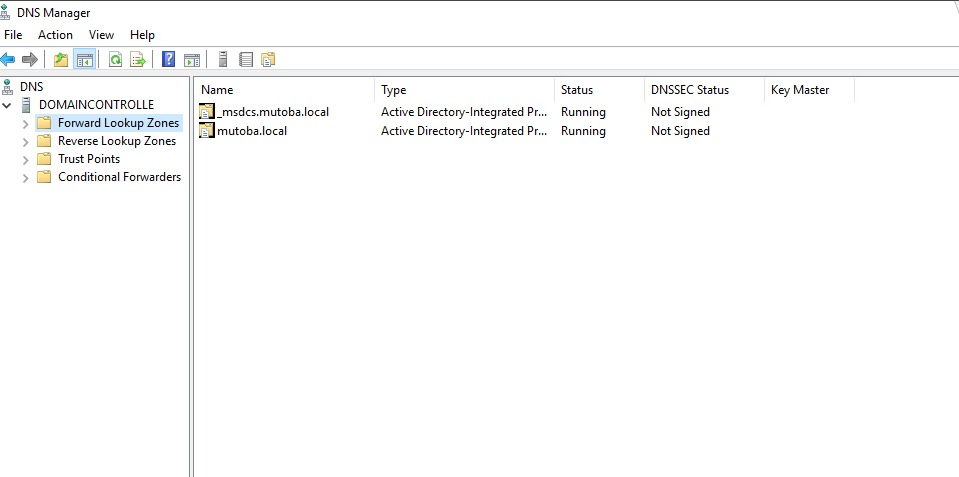

# Windows Server 2019 – Active Directory Lab

## Lab Overview

This project demonstrates a hands-on deployment of a Windows Server 2019 Active Directory Domain Services (AD DS) environment using VMware ESXi.

### Environment Details
- **Hypervisor:** VMware ESXi 8.0  
- **Server OS:** Windows Server 2019  
- **Client OS:** Windows 10 (domain-joined for testing)  
- **Domain Name:** mutoba.local  
- **Roles Installed:**  
  - Active Directory Domain Services (AD DS)  
  - DNS Server  

---

## Architecture Overview

- One ESXi host running multiple virtual machines  
- Dedicated Windows Server 2019 VM as Domain Controller  
- DNS integrated with Active Directory  
- Centralized user, group, and computer management  

---

## ESXi Host and Virtual Machines

---

## Step 1: Prepare Windows Server

- Installed Windows Server 2019
- Applied Windows Updates
- Renamed server to **DC01**
- Configured a static IP address
- Verified network connectivity

---

## Step 2: Install Active Directory Domain Services

- Opened **Server Manager**
- Added the **Active Directory Domain Services (AD DS)** role
- Installed **DNS Server** role
- Promoted the server to a **Domain Controller**
- Created a new forest: **mutoba.local**

### Server Manager Roles

---

## Step 3: Verify Active Directory Configuration

- Opened **Active Directory Users and Computers**
- Verified domain structure
- Confirmed default Organizational Units (OUs)
- Validated domain security groups and users

### Active Directory Users and Computers

---

## Step 4: Verify DNS Configuration

- Opened **DNS Manager**
- Confirmed forward lookup zones
- Verified AD-integrated DNS records
- Ensured domain name resolution was functional

### DNS Manager

---

## Skills Demonstrated

- Windows Server 2019 administration  
- Active Directory Domain Services (AD DS)  
- DNS configuration and troubleshooting  
- VMware ESXi virtualization  
- Server hardening and network configuration  
- Technical documentation and lab validation  

---

## Result

Successfully deployed a fully functional Active Directory domain environment with DNS integration, enabling centralized authentication, name resolution, and administrative control suitable for enterprise environments.
